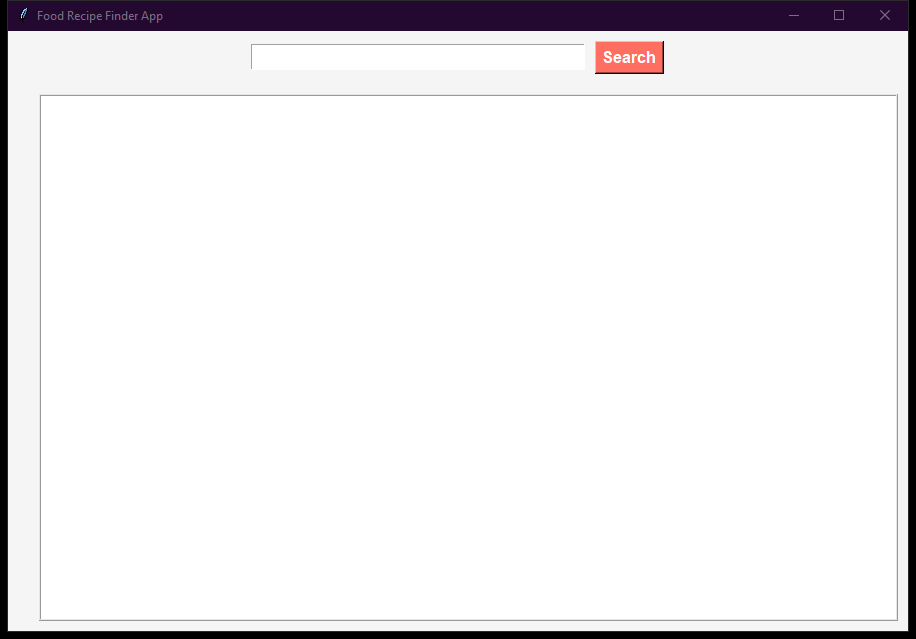

# MASA Culinary Compass

Recipe discovery and meal planning dashboard searching by ingredients, nutrition, and cuisine

## Technical Architecture

The application is architected with modular separation of concerns adhering to modern clean code standards:

- **Component Layering**: Isolated view layouts, state managers, and service controllers.
- **Defensive Engineering**: Robust input sanitization and exception management.
- **Modern Design Standards**: High-contrast dark-mode interface styled for optimal usability and visual polish.

## Preview



## Features

- Ingredient-driven recipe search query engine.
- Detailed preparation instructions, ingredient quantities, and dietary tags.
- Caloric and macronutrient nutritional breakdown dashboard.
- Favorites bookmarking system with offline recipe caching.

## Prerequisites

- Python 3.10 or higher
- Required packages:

```bash
pip install customtkinter pillow requests
```

## Execution

Launch the application via Python:

```bash
python "Food Recipe Finder App Using Tkinter in Python/main.py"
```

## Project Structure

```
.
├── Food Recipe Finder App Using Tkinter in Python
├── screenshots/
│   └── app_interface.png
├── .gitignore
├── LICENSE             # MIT License
└── README.md           # Developer documentation
```

## License

This project is licensed under the terms of the MIT License. Refer to the `LICENSE` file for details.
